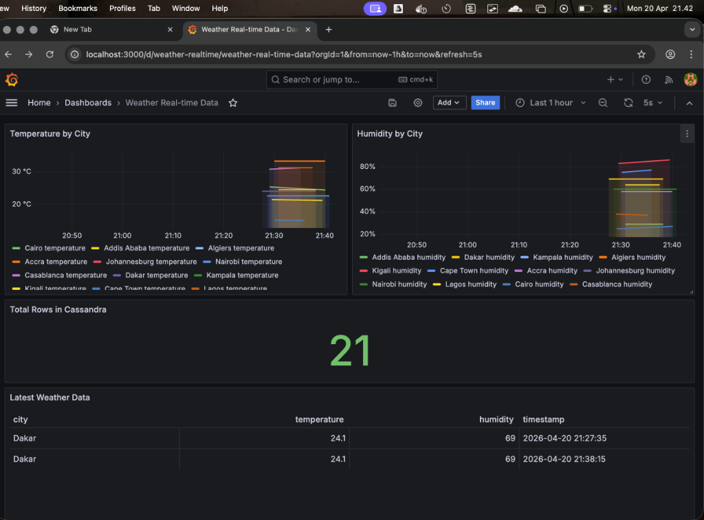

# Real-Time Weather Data Pipeline: Kafka + Cassandra + Grafana



This project demonstrates a production-ready, real-time data streaming pipeline that fetches live weather data from OpenWeatherMap, streams it through Apache Kafka, stores it persistently in Apache Cassandra, and visualizes the trends in real-time using Grafana. 

It is designed to handle high-throughput concurrent API calls and ensures perfect temporal data alignment using strict UTC timezone standards.

## Architecture

1. **Producer ([`weather_producer.py`](weather_producer.py))**: A high-performance Python script that uses `ThreadPoolExecutor` to fetch weather data for 12 major African cities concurrently from the OpenWeatherMap API and publishes it to a Kafka topic.
2. **Kafka (Confluent Cloud)**: Acts as the high-throughput message broker bridging the producer and consumer.
3. **Consumer ([`weather_consumer.py`](weather_consumer.py))**: Subscribes to the Kafka stream, extracts the precise measurement timestamp, sanitizes it to UTC-0, and performs an upsert into Apache Cassandra.
4. **Database (Apache Cassandra)**: Provides scalable, time-series optimized storage. Primary keys are configured as `(city, timestamp)` to ensure data integrity and prevent duplicates.
5. **Visualization (Grafana)**: Uses the `hadesarchitect-cassandra-datasource` plugin to query Cassandra and visualize temperature and humidity across multiple cities in a live-updating dashboard.

## Prerequisites

- Python 3.8+
- Docker & Docker Compose (for local Grafana & Cassandra)
- Apache Kafka cluster (e.g., Confluent Cloud)
- OpenWeatherMap API key

## Setup & Installation

### 1. Environment Configuration

Rename `.env.example` to `.env` (or create one) and configure your Kafka and OpenWeather parameters:

```env
KAFKA_BOOTSTRAP_SERVERS=pkc-xyz.us-central1.gcp.confluent.cloud:9092
SASL_USERNAME=your_kafka_api_key
SASL_PASSWORD=your_kafka_api_secret
OPENWEATHER_API_KEY=your_openweather_key
TOPIC=weather-stream
CASSANDRA_HOST=localhost
```

### 2. Infrastructure Setup (Docker)

Start the local Cassandra database and Grafana instances via Docker Compose:

```bash
docker-compose up -d
```

Initialize the Cassandra keyspace and tables (you can run `setup_cassandra.py` or manually execute queries in `cqlsh`):

```bash
python setup_cassandra.py
```

### 3. Run the Streaming Pipeline

Install the Python dependencies:

```bash
pip install -r requirements.txt
# (or just pip install confluent-kafka cassandra-driver requests python-dotenv)
```

In one terminal tab, start the Consumer to listen for data:
```bash
python weather_consumer.py
```

In another terminal tab, start the Producer to fetch and stream data:
```bash
python weather_producer.py
```

### 4. Configure Grafana

1. Navigate to Grafana at `http://localhost:3000` (default login: `admin`/`admin`).
2. Add the **Apache Cassandra** data source (requires the `hadesarchitect-cassandra-datasource` plugin, pre-installed via our `docker-compose.yml`).
3. Set the connection URL to `cassandra:9042`.
4. Import the provided dashboard found in `provisioning/dashboards/weather_dashboard.json`.

## Key Technical Decisions
* **Concurrency**: We replaced sequential API fetching with a `ThreadPoolExecutor` to process all 12 cities in under `0.2s` per cycle.
* **Timezone Safety (UTC)**: Consumers explicitly cast all localized API measurement times (`dt`) to `timezone.utc` preventing future-dating data in Cassandra and ensuring Grafana visualizes the correct real-time windows.
* **Data Parity Checks**: Includes dedicated utility scripts (`verify_parity.py`) designed to validate that 100% of messages generated by the producer land definitively in the Cassandra database.
